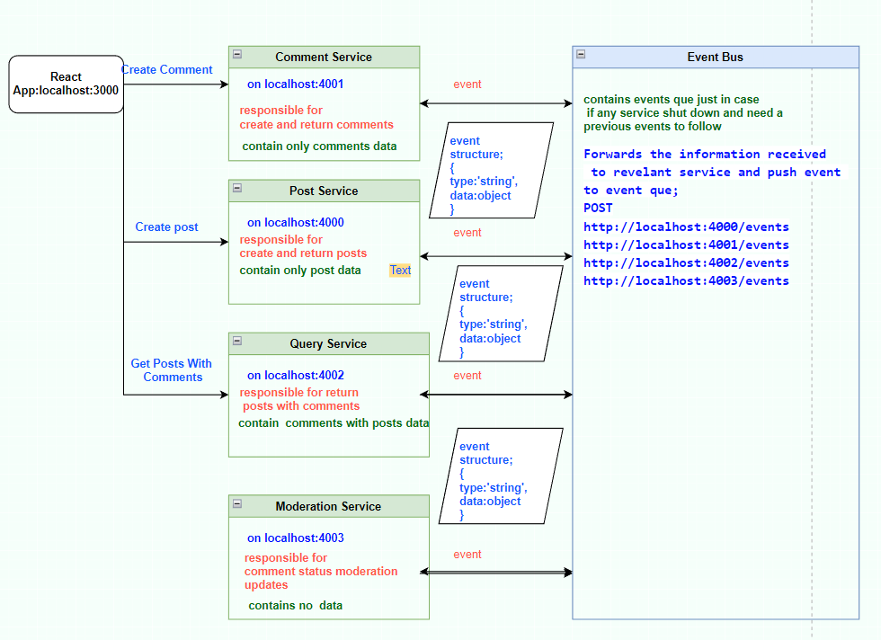

# Nodejs-React-mini-microservices-app

This is the basic implementation of microservices with nodejs and react.  
Mainly focused on microservice architecture so services doesn't include data base (datas storing on memory) 
Event bus service created by node.js for understanding simple event bus logic so project doesn't include a event bus libraries.   

Project architecture; 

  
